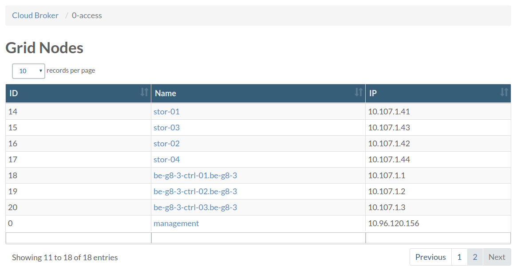

# Setting up the kubernetes cluster

This is a Documentation of the installation steps to setup an ovc cluster, please check the documentation for the script at [Installer-script](Installer-script.md)

## Prerequisites

- A JumpScale 9 installation(Preferably use docker image `openvcloud/js9`, otherwise see [docs](https://github.com/Jumpscale/bash) for installation)
- Three nodes for deploying the cluster
- Additional nodes for cpu/storage as required. 
- For each node the user needs to have credentials to establish a SSH connection
- Swap needs to be off on each node
- Each node needs to be able to access each other node in the cluster
- three files for ssl verification need to be added to the  specified path in the yaml config on the machine all wit
  the same name and have these extensions:
  - .csr
  - .crt
  - .key
- `jsonschema` python library

## Full environment setup

Using the docker image `openvcloud/js9` create a docker container which will have a JumpScale 9 installation.

You will need the openvcloud installer repo as well, clone it using the following command:

```bash
git clone https://github.com/0-complexity/openvcloud_installer/
```

Before starting a config file for the new environment needs to be ready. This config file will be used by the `installer` to get information necessary for its multiple functions. an example config file can be found in `{repo location}/scripts/kubernetes/config`. This config file needs to be pushed to a new repo on `docs.greenitglobe.com` under `gigtech` organization with the naming convention being `env_{env name}`. An example url: `https://docs.greenitglobe.com/gigtech/env_be-g8-4`

Go to the installer script directory: `{repo location}/scripts/install`, for easy access to the `installer` script.

### Deploying the cluster

Run the following command to deploy the kubernetes cluster:

```bash
./installer --config {config file} --version {installation version} cluster deploy
```

The two options in the command are:

- `config` specified the path of the config file on the filesystem.
- `version` specified the required release to be installed, for all releases check [here](https://github.com/0-complexity/home/tree/master/manifests).

After the above command is done a kubernetes cluster should be up and pods handling several openvcloud environment process should be running.
From the management pod(See next section for how to access) it is possible to check the status of all pods using the command:

```bash
kubectl get pods
```

If all pods are running then it is possible to continue to the next step.

### Accessing management pod

Management pod is used to perform various admin opertaions on the environment. It is based on the same JumpScale 9 image and has `kubectl` tool installed that is needed to perform various kubernetes related operations.

Accessing the management pod can be done using 0-access.

From a web browser open the openvcloud portal and go to 0-access page at `https://{env name}.demo.greenitglobe.com/cbgrid/0-access`.



Choose `maangement` from the above list, you will be directed to a page that will allow you to request an access to the pod which will redirect you to a page with instructions about how to access the pod and the remaining time for this session.

### Installing os on nodes

You need to be in management pod to perform this operation.

To prepare the cpu/storage nodes with necessary os run the following command:

```bash
installer --config {config file} node action --name all install_os
```

### Installing storage nodes

From Management pod
```bash
export ENVNAME="be-g8-3"
ssh -A ovs # this will get you on the ovs pod (specially prepared to have systemd)  
# lets generate the config
cd /opt/code/github/0-complexity/openvcloud_installer/scripts/ovs/
python3 ovs_configurator.py --config_path=/opt/cfg/system/system-config.yaml
# clone ovs autoinstaller
mkdir /opt/code/github/openvstorage/
cd /opt/code/github/openvstorage
git clone git@github.com:openvstorage/dev_ops.git -b 4.1.4
mkdir -p dev_ops/Ansible/openvstorage/playbooks/inventories/$ENVNAME/group_vars
# copy our generated files
cp /opt/code/github/0-complexity/openvcloud_installer/scripts/ovs/output/{inventory,setup.json} /opt/code/github/openvstorage/dev_ops/Ansible/openvstorage/playbooks/inventoeries/$ENVNAME/
cp /opt/code/github/0-complexity/openvcloud_installer/scripts/ovs/output/all /opt/code/github/openvstorage/dev_ops/Ansible/openvstorage/playbooks/inventoeries/$ENVNAME/group_vars
# preinstall script which installs ansible
bash /opt/code/github/openvstorage/dev_ops/Ansible/openvstorage/bin/pre-install.sh
cd /opt/code/github/openvstorage/dev_ops/Ansible/playbooks/
ansible-playbook -i inventories/$ENVNAME/inventory preInstall.yml
# this last step is not very bullet proof and might need to be repeated
ansible-playbook -i inventories/$ENVNAME/inventory full_setup.yml

```

### Installing JumpScale services on nodes

You need to be in management pod to perform this operation.

The following command will install JumpScale services on all physical nodes(controllers, cpu, storage):

```bash
installer --config {config file} node jsaction --name all install
```
```bash
installer node jsaction --name ctrl-01,ctrl-02,ctrl-03 install
```
Following the success of these steps the environment should be ready to use.
