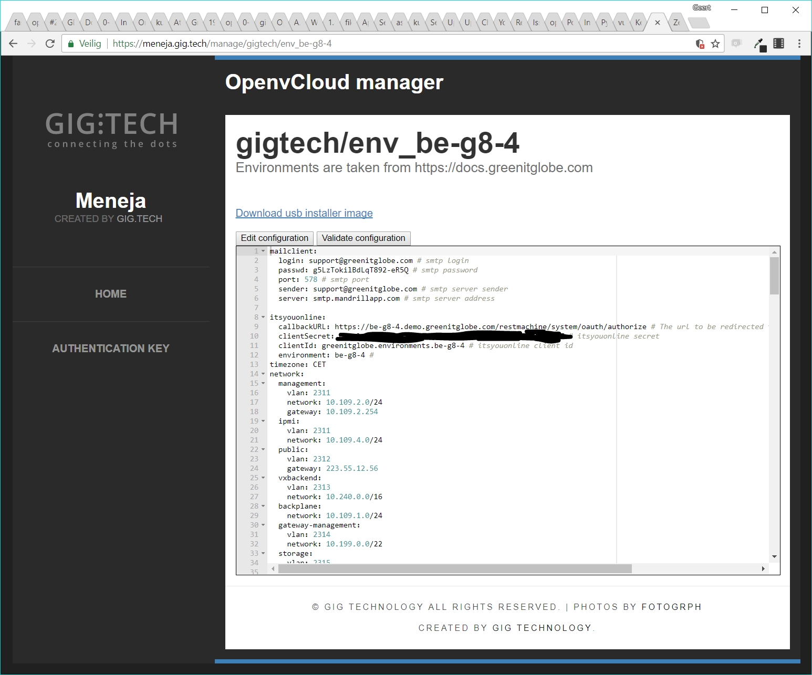
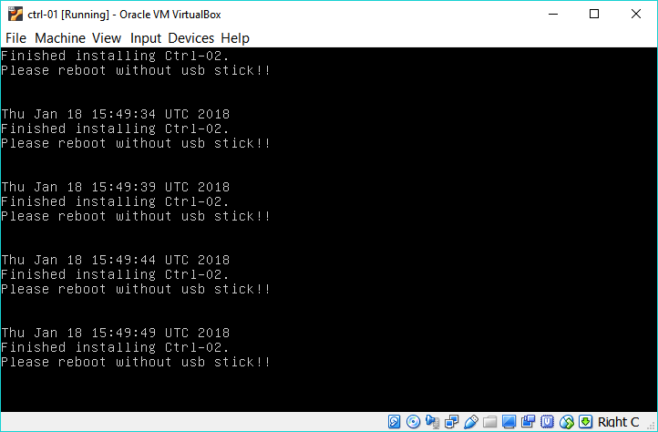
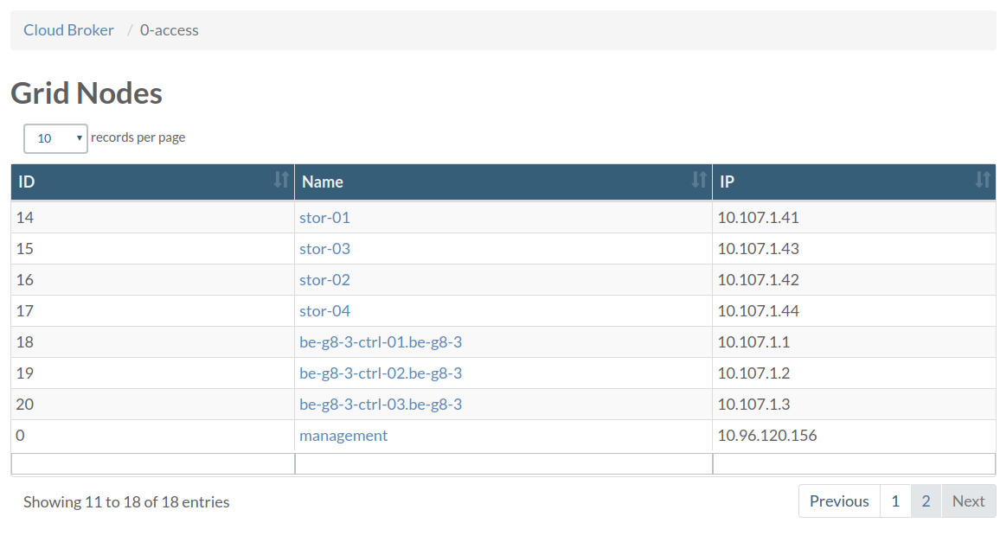

# OpenvCloud Cluster Setup

Setting up an OpenvCloud cluster is done in following steps:
- [Meet the prerequisites](#prerequisites)
- [Create the configuration file](#create-config)
- [Validate the configuration file](#validate-config)
- [Configure the switches](#configure-switches)
- [Install operation system on the controller nodes](#controller-os)
- [Create and start the JumpScale 9 Docker container](#js9-container)
- [Setup the Kubernetes cluster and deploy the OpenvCloud system containers](#kubernetes-cluster)
- [Access the management container](#management-container)
- [Install the operating systems on the nodes](#os-nodes)
- [Setup the storage nodes](#storage-nodes)
- [Install JumpScale services on nodes](#jumpscale-nodes)
- [Deploy virtual machine images](#deploy-images)


<a id="prerequisites"></a>
## Meet the prerequisites

- Currently supported G8 size:
  - 3 dedicated controller nodes
  - 10 dedicated CPU nodes
  - 4 dedicated storage nodes
- SSH access credentials for all nodes
- Swap needs to be off on each node
- Each node needs to be able to access each other node in the cluster
- Three files for SSL verification need to be added to the specified path in the YAML config on the machine all with the same name and have these extensions:
  - .csr
  - .crt
  - .key
- `jsonschema` python library


<a id="create-config"></a>
## Create the configuration file

Installing an OpenvCloud cluster is done based on a single `system-config.yaml` configuration file.

This configuration files describes:
- Switch configuration
- Operating system installations
- Kubernetes cluster running on the controllers, which hosts the OpenvCloud master and and all other controller components
- CPU and storage nodes installation
- ...

The `system-config.yaml` file needs to be stored and maintained in the root of a Git repository on `https://docs.greenitglobe.com`; for each G8 installation there is distinct Git repository on https://docs.greenitglobe.com

The following rules apply:
- The name of the repository should be formatted `env_<<descriptive environment specification>>`, e.g. `env_be-g8-4`
- The repository needs to be put in an organization that represents the partner or customer, e.g. `gigtech` organization for G8s owned by GIG itself, or `digitalenergy` for our Russian partner

Some example repositories:
  - https://docs.greenitglobe.com/gigtech/env_be-g8-4
  - https://docs.greenitglobe.com/gigtech/env_se-sto-en01-001
  - https://docs.greenitglobe.com/digitalenergy/env_mr4

An example of a `system-config.yaml` can be found here: https://github.com/0-complexity/openvcloud_installer/blob/master/scripts/kubernetes/config/system-config.yaml

> **Important** A common technique to create a `system-config.yaml` is to make a copy from another environment and start editing. Please make sure to alter the `ssh.private-key` setting, and not just leave the copy from the other environment.


<a id="validate-config"></a>
## Validate the configuration file

Having valid configuration is off course very important. Validating is done with the OpenvCloud environment manager, a.k.a. **Meneja** (Swahili for 'manager'), available on https://meneja.gig.tech.

In [Meneja](https://meneja.gig.tech) you can select the environment you are setting up, and click the **Validate configuration** button. When your configuration is valid, you'll see the following text appear next to the button: **"The configuration is valid!"***


<a id="controller-os"></a>
## Install the operation system on the controller nodes

On [Meneja](https://meneja.gig.tech) a USB stick can be downloaded that already has the custom configuration for a specific environment. As shown on the screenshot below, there is a link called "Download usb installer image" which results in a bootable ISO file, that can be used to boot from (via the IPMI or via burning it onto a USB stick):



After booting up the controller node with the boot image, the user gets a screen with the following options:


The rest is extremely simple. Just select the right option depending on the controller node that needs to be installed, and the rest is completely automatic.

Once you see the following screen, the installation of the controller node has finished. Just unplug the installer image, and reboot the machine.



Repeat this procedure for all three controllers.

<a id="configure-switches"></a>
## Configure the switches

@TODO


<a id="js9-container"></a>
## Create and start the JumpScale 9 Docker container

Setting up an OpenvCloud environment requires a JumpScale 9 Docker container on the first controller node.

The image for this Docker image is available on Docker Hub: https://hub.docker.com/r/openvcloud/js9/.

Install Docker on the first controller node:
```bash
curl -fsSL https://download.docker.com/linux/ubuntu/gpg | apt-key add -
add-apt-repository "deb [arch=amd64] https://download.docker.com/linux/ubuntu $(lsb_release -cs) stable"
apt-get update
apt-get install libltdl7 aufs-tools
apt-get install docker-ce=17.03.0~ce-0~ubuntu-xenial
```

Create and start the required [openvcloud/js9/](https://hub.docker.com/r/openvcloud/js9/) Docker container:
```bash
docker run --rm -it openvcloud/js9:2.3.0 /bin/bash 
```

The installation also requires that you clone the OpenvCloud installer repository into the Docker container:
```bash
git clone https://github.com/0-complexity/openvcloud_installer/
```


<a id="kubernetes-cluster"></a>
### Setup the Kubernetes cluster and deploy the OpenvCloud system containers

In the Docker container use the [installer](../scripts/install/installer) script as follows to setup the Kubernetes cluster on the controllers:
```bash
cd /opt/code/github/0-complexity/openvcloud_installer/scripts/install
./installer --version {installation version} --config {config file path} cluster deploy
```

The two options in the command are:
- `--version` specifies the required release to be installed, e.g. ` 2.3.0`; for all releases check [here](https://github.com/0-complexity/home/tree/master/manifests)
- `--config` specifies the path of the config file on the filesystem, typically you copy the file on the root of the container: `/system-config.yaml`

The [installer](../scripts/install/installer) script will create a Kubernetes cluster, and deploy all OpenvCloud system containers needed to manage an OpenvCloud cluster.

One of these containers is the management container, through which you will be able to check the status of all other containers;discussed next.

For more details about the `ìnstaller` script see [Installer Script Details](Installer-script.md).


<a id="management-container"></a>
## Access the management container

The management container is used to perform various admin operations on the environment. It is based on the same JumpScale 9 image and has the `kubectl` tool installed that is needed to perform various Kubernetes related operations.

Accessing the management container can be done using **0-access**.

From a web browser open the OpenvCloud portal and go to the **0-access** page at `https://{env name}.demo.greenitglobe.com/cbgrid/0-access`.



Choose `management` from the list. You will be directed to a page that will allow you to request access to the pod which will redirect you to a page with instructions about how to access the management container and the remaining time for this session.

In the management container you can check the status of all pods using the following command:
```bash
kubectl get pods
```

If all pods are running continue to the next step.


<a id="os-nodes"></a>
## Installing the operating system on the nodes

You need to be in management container to perform this operation.

To prepare the CPU and storage nodes with the necessary OS run the following command:
```bash
installer --config {config file} node action --name all install_os
```


<a id="storage-nodes"></a>
## Setup the storage nodes

From the management container execute:
```bash
export ENVNAME="be-g8-3"
ssh -A ovs # this will get you on the Open vStorage pod (specially prepared to have systemd)  
# let's generate the config
cd /opt/code/github/0-complexity/openvcloud_installer/scripts/ovs/
python3 ovs_configurator.py --config_path=/opt/cfg/system/system-config.yaml
# clone Open vStorage  autoinstaller
mkdir /opt/code/github/openvstorage/
cd /opt/code/github/openvstorage
git clone git@github.com:openvstorage/dev_ops.git -b 4.1.4
mkdir -p dev_ops/Ansible/openvstorage/playbooks/inventories/$ENVNAME/group_vars
# copy our generated files
cp /opt/code/github/0-complexity/openvcloud_installer/scripts/ovs/output/{inventory,setup.json} /opt/code/github/openvstorage/dev_ops/Ansible/openvstorage/playbooks/inventoeries/$ENVNAME/
cp /opt/code/github/0-complexity/openvcloud_installer/scripts/ovs/output/all /opt/code/github/openvstorage/dev_ops/Ansible/openvstorage/playbooks/inventoeries/$ENVNAME/group_vars
# preinstall script which installs Ansible
bash /opt/code/github/openvstorage/dev_ops/Ansible/openvstorage/bin/pre-install.sh
cd /opt/code/github/openvstorage/dev_ops/Ansible/playbooks/
ansible-playbook -i inventories/$ENVNAME/inventory preInstall.yml
# this last step is not very bullet proof and might need to be repeated
ansible-playbook -i inventories/$ENVNAME/inventory full_setup.yml
```


<a id="jumpscale-nodes"></a>
## Install JumpScale services on the OpenvCloud cluster nodes

You need to be in management container to perform this operation.

The following command will install the JumpScale services on all OpenvCloud cluster nodes (CPU and storage):
```bash
installer --config {config file} node jsaction --name all install
```

For more details about the `ìnstaller` script see [Installer Script Details](Installer-script.md).

When done, the environment should be ready to use.


<a id="deploy-images"></a>
## Deploy virtual machine images

@TODO
