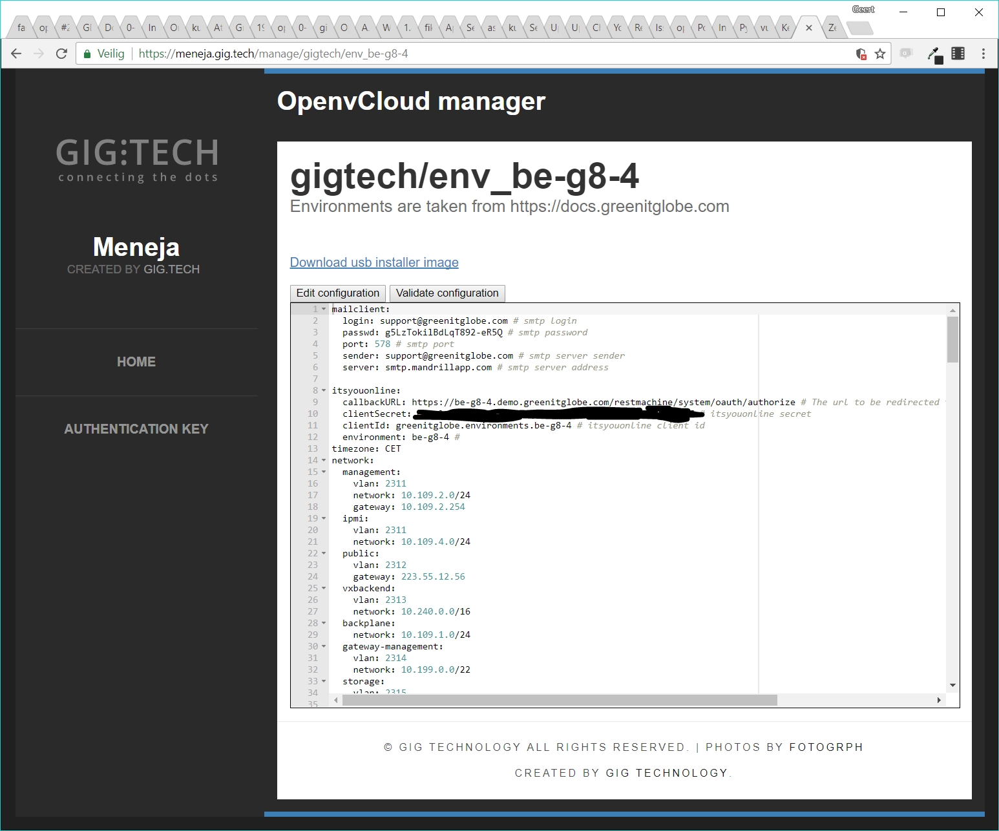
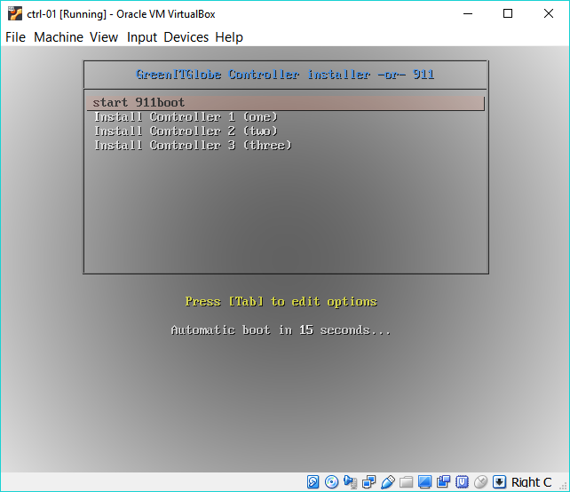
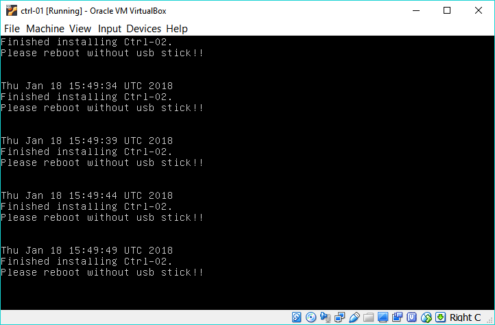

# Installation & configuration strategy

## Installation procedure
- Kubernetes cluster
  - Install kubernetes hosts using usb key
    - Automatically install OS
    - Put disks into mirror
    - Do partitioning
      - / ==> /dev/sda1
        - 40GB
        - ext4
        - OS parts
      - /var ==> /dev/sda2
        - The rest of the space
        - btrfs (disable copy on write)
          - For informational purposes we add here which btrfs subvolumes will be created later on.
          - subvolumes
            - billing
              - mountpath: `/var/ovc/billing`
              - need to set quota
              - replicated by synchting
            - influxdb
              - mountpath: `/var/ovc/infuxdb`
              - need to set quota
              - replicated by synchting
            - mongodb
              - mountpath: `/var/ovc/mongodb`
              - need to set quota
              - replicated by mongodb
  - Configure network of the host
  - Reboot the nodes to live system
  - Install ha kubernetes cluster using prefab9, on all the nodes
- Install synchting replication kubernetes services
- Install master kubernetes services
  - Syncthing replication between nodes host paths
  - MongoDB cluster deployment
  - Osis deployment
  - JS-Agent / Agentcontroller deployment
  - Grafana deployment
  - Portal deployment
- Install controller kubernetes services
  - JS-Agent deployment
  - InfluxDB deployment
  - Stats collector deployment
- Install JS-Agent on each of the kubernetes hosts

## Step one: getting the configuration in place

Installing all components of OpenvCloud is steered by a single `system-config.yaml` configuration file that contains all the information needed to install OpenvCloud and everything related. Going from the switch configuration, to installing the OS on the controllers, the kubernetes cluster running on the controllers serving the OpenvCloud master and controller components, to installing the cpu & storage nodes, ..., everything is driven from this single configuration file.

The `system-config.yaml` file needs to be stored and maintained in the root of a git repository on `https://docs.greenitglobe.com`. The following rules need to be followed:
- Each G8 environment has its proper environment git repository in docs.greenitglobe.com
- The name of the repository should be formatted `env_<<descriptive environment specification>>`. E.g. `env_be-g8-4`
- The repository needs to be put in an organization that represent the partner. E.g. `gigtech` organization for G8's owned bi GIG itself, or `digitalenergy` for our Russian partner. Putting this together, a couple of examples:
  - https://docs.greenitglobe.com/gigtech/env_be-g8-4
  - https://docs.greenitglobe.com/gigtech/env_se-sto-en01-001
  - https://docs.greenitglobe.com/digitalenergy/env_mr4

An example of a `system-config.yaml` can be found here: https://github.com/0-complexity/openvcloud_installer/blob/master/scripts/kubernetes/config/system-config.yaml

> **Important** A common technique to create a `system-config.yaml` is to make a copy from another enviroment and start editing. Please make sure to alter the ssh.private-key setting, and not just leave the copy from the other environment.

### Validating your OpenvCloud configuration
Having valid configuration is off course very important, for a smooth installation process. This can be done with the OpenvCloud environment manager AKA (Menaja -- Swahili for 'manager'). Login on https://menaja.gig.tech select the environment you are setting up, and click the "Validate configuration" button. When your configuration is valid, you'll see the following text appear next to the button: "You configuration is valid!"

## Step two: Configuring the switches
[to be completed as soon as implementation is ready]

## Step three: Installing the OS on the controllers

### Using the generic 911 usb stick installer
[to be completed as soon as this mechanisme is ready]

### Using the environment specific usb stick installer
On [Meneja](https://meneja.gig.tech) a usb stick can be downloaded that already has the custom configuration for a specific environment. As shown on the screenshot above, there is a link called "Download usb installer image" which results in a bootable iso, that can be used to boot from (via the ipmi or via burning it onto a usb stick.).

After booting up the controller node with the boot image, the user gets a screen with the following options:

The rest is extremely simple. Just select the right option depending on the controller node that needs to be installed, and the rest is completely automatic.

Once you see the following screen, the installation of the controller node has finished. Just unplug the installer image, and reboot the machine.

Repeat this procedure for all three controllers.

## Step four: Installing the OpenvCloud brain on the controller nodes

## Step five: Bootstrapping the cpu and storage nodes with their operating system

## Step six: Installing OpenvStorage

## Step seven: Installing the OpenvCloud agents

## Step eight: Deploying virtual machine images